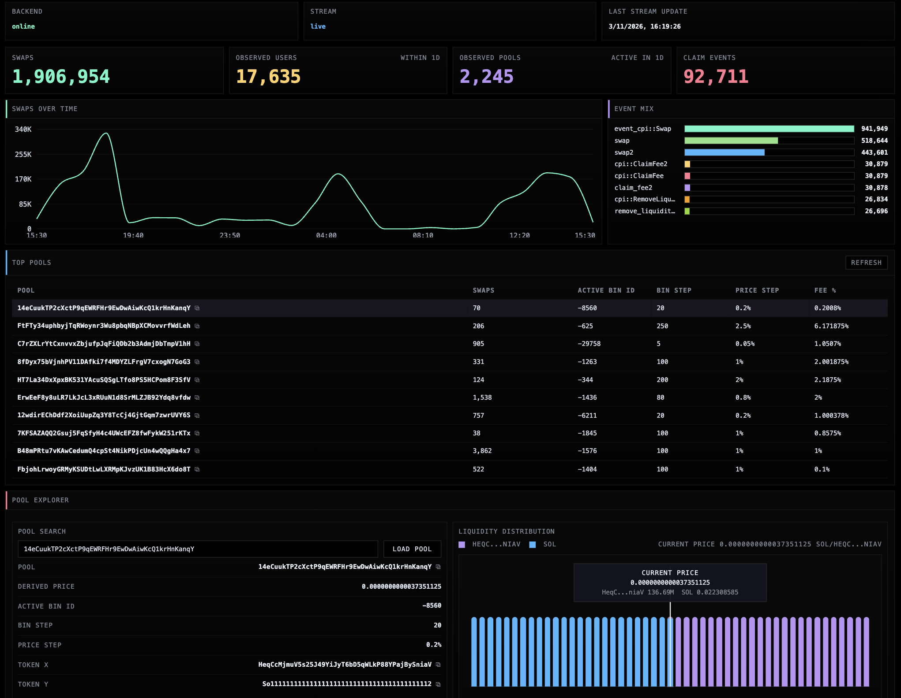
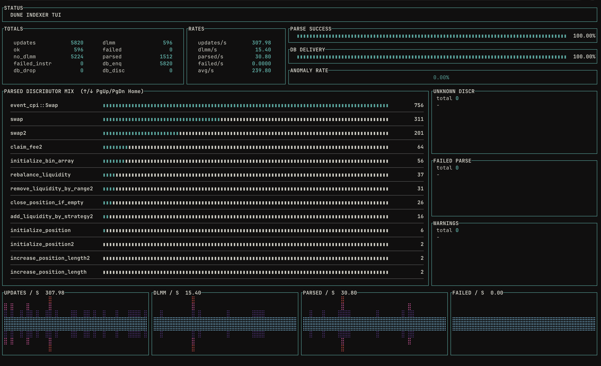
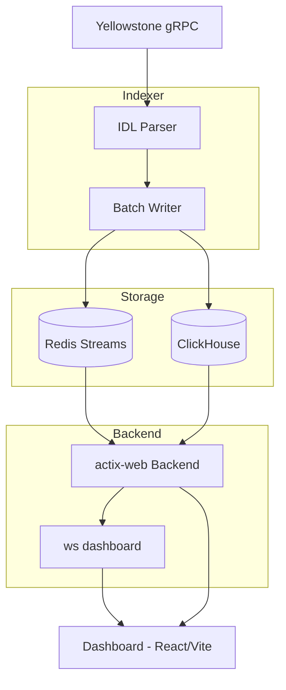

# Dune Project

Solana-focused data platform prototype for Meteora DLMM:

- real-time Yellowstone ingestion (`indexer`)
- IDL-driven decode + enrichment
- ClickHouse event storage
- Redis stream flush signaling
- Rust backend (`actix-web`) for query + CSV + websocket snapshots
- React/Vite dashboard for live protocol + pool views

## Screenshots

Dashboard (backend snapshots + pool explorer + live analytics):



Indexer TUI (parse/ingestion quality surface in terminal):



## What It Does

1. Reads Solana updates from Yellowstone gRPC.
2. Parses Meteora DLMM instructions/events (including inner instructions).
3. Persists:
   - parser update metrics (`parser_update_metrics`)
   - failure payload samples (`failed_payloads`)
   - canonical event facts (`dlmm_events`)
4. Publishes flush signals to Redis Streams.
5. Backend consumes Redis signals and pushes fresh dashboard snapshots over websocket.

## Architecture



## Repository Layout

- `indexer/` Rust ingestion + parser + TUI
- `backend/` Rust query/websocket server
- `dashboard/` React/Vite frontend
- `schema/` ClickHouse schema source of truth (`clickhouse_v2.sql`)
- `scripts/` local dev/run/reset/demo/smoke helpers
- `images/` README screenshots

## Prerequisites

- Docker + Docker Compose
- Rust toolchain
- Node.js + npm
- Yellowstone endpoint (and token if required)

## Environment

Create and fill:

- `indexer/.env`
- `backend/.env`

Use:

- `indexer/.env.example`
- `backend/.env.example`

## Local Run

From project root:

```bash
make up
make schema
```

Terminal 1 (backend + dashboard):

```bash
make app
```

Terminal 2 (indexer TUI):

```bash
make indexer
```

Optional all-in-one command:

```bash
make dev
```

Notes:

- `make dev` runs indexer in background/silent mode (`INDEXER_TUI=0`, `INDEXER_PLAIN_LOGS=0`).
- Use `make indexer` for interactive TUI.

## Local URLs

- Dashboard: `http://127.0.0.1:5174`
- Backend: `http://127.0.0.1:8080`

## Key Endpoints

System:

- `GET /health`
- `GET /metrics`

Core query:

- `GET /v1/pools/top?minutes=60&limit=10`
- `GET /v1/pools/{pool}/explorer?minutes=60`
- `GET /v1/pools/{pool}/events?limit=100`

Analytics + live:

- `GET /v1/analytics/dashboard?minutes=1440&limit=10`
- `GET /ws/dashboard?minutes=1440&limit=10`

Observability:

- `GET /v1/ingestion/lag`
- `GET /v1/quality/latest`
- `GET /v1/quality/window?minutes=60`

Export:

- `GET /v1/export/events.csv?limit=1000`

## Validation

```bash
make smoke
make demo
```

`scripts/demo.sh` supports:

- `API_BASE`
- `MINUTES`
- `POOL`
- `CSV_LIMIT`
- `CSV_OUT` (defaults to `exports/...`)

## Current Scope

- Solana + Meteora DLMM only
- local/dev deployment model
- no auth/rate-limits/multi-tenant controls
- raw token amount volume is exposed as `volume_raw` (not USD-normalized)
